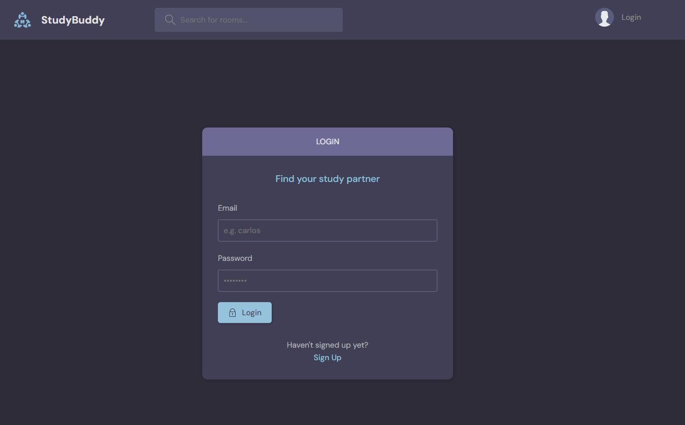
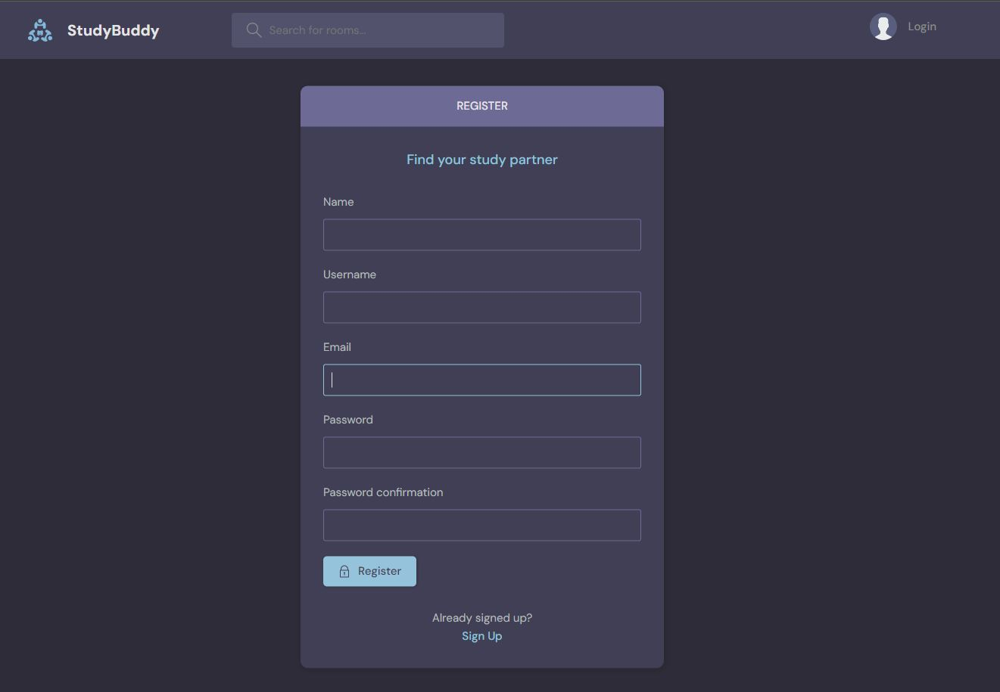
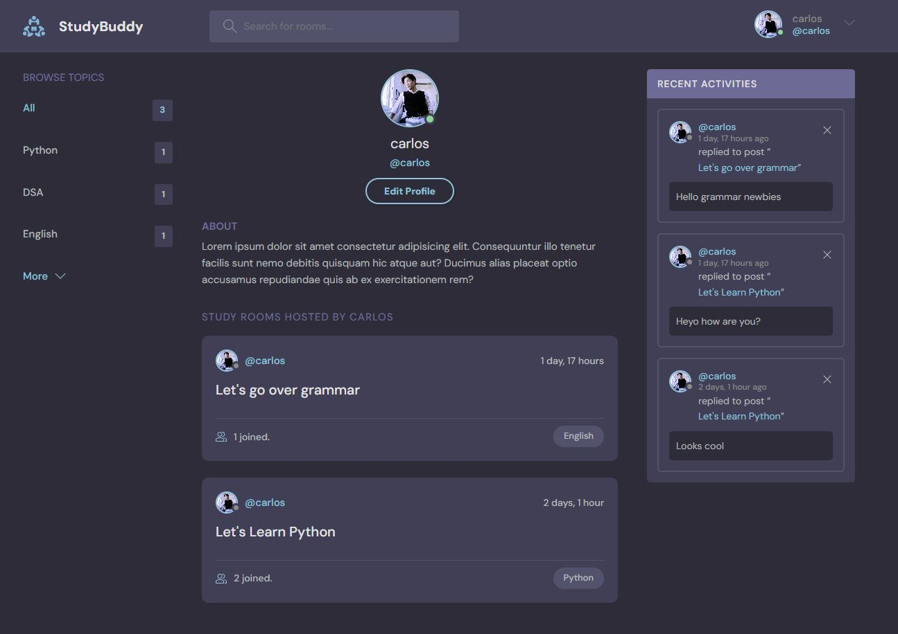
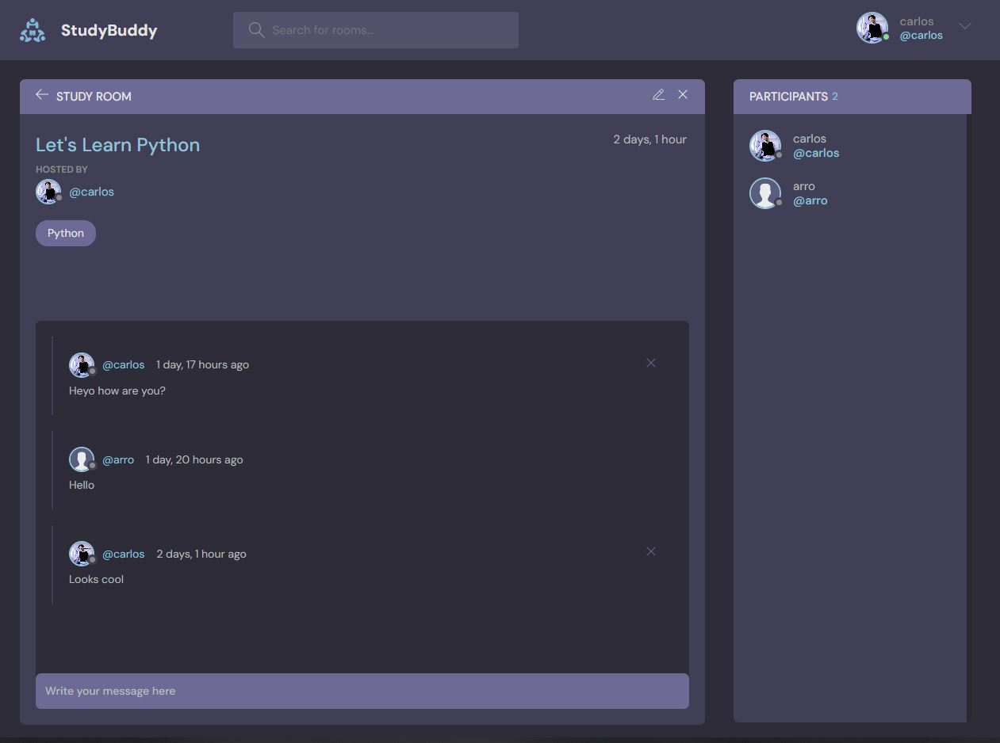
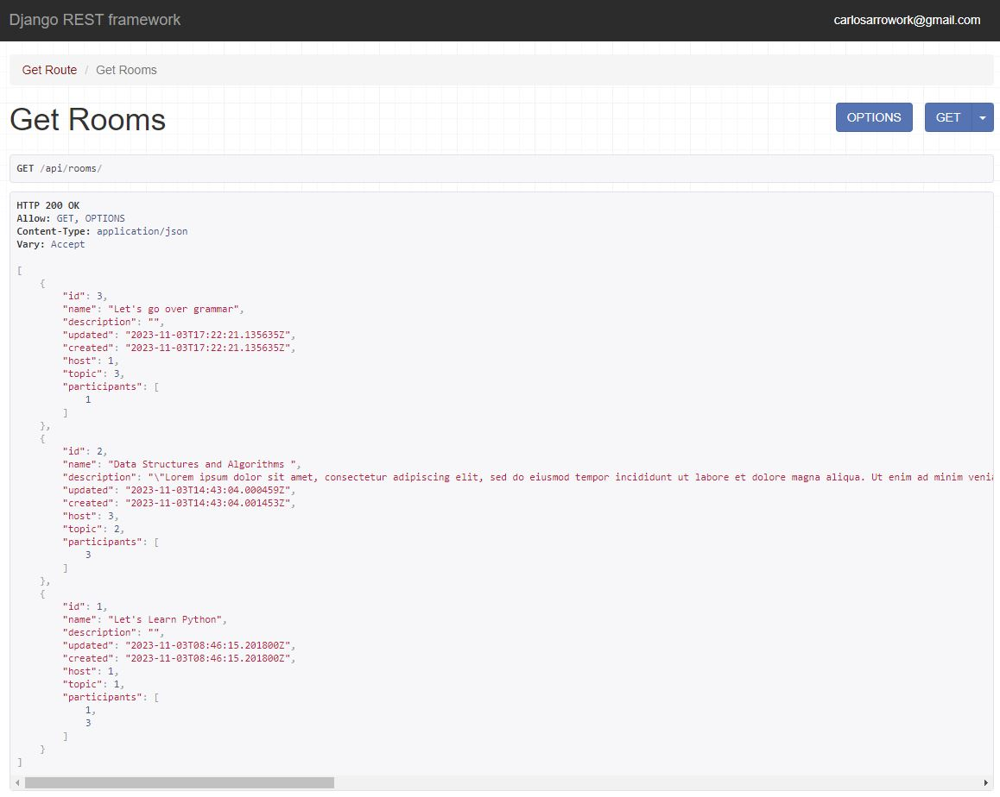
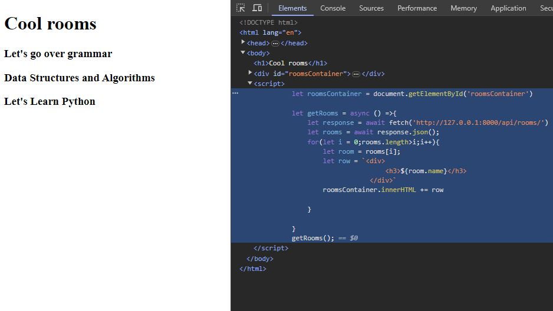

# StudyBud

## Cloning Rep 
Use the link below
```
https://github.com/CRA2001/StudyBud.git

```

Install the requirements :
```bash
pip install -r requirements.txt

```
## What is it?
StudyBud, is a s social app that allows users to create chatrooms for learning.
Users are able to create and edit profiles, create chatrooms for every topic and join chatrooms to interact with others while learning.
This was developed using : 
- Django
- Django REST framework
- HTML
- CSS
- Javascript
- SQLite (for the database)

### App main feed

### Login Page

### Registration Page

### Profile Page

### Chatroom

### REST API

### REST API in action from the coolwebsites.html as an example



